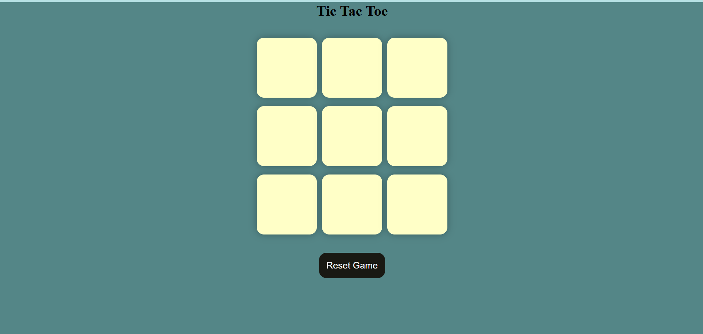

# Tic Tac Toe

A simple and interactive Tic Tac Toe game developed using HTML, CSS, and JavaScript. The project provides a clean user interface and allows two players to play the classic game directly in the browser.

## Live Demo

https://gaurav-projects07.github.io/tik-tak-toe/

## Preview



## Features

* Two-player gameplay
* Interactive game board
* Winner detection logic
* Draw detection
* Game reset functionality
* Responsive and user-friendly interface

## Technologies Used

* HTML5
* CSS3
* JavaScript (ES6)

## Project Structure

```text
tik-tak-toe/
│
├── assets/
│   └── screenshot.png
│
├── index.html
├── styles.css
├── jscode.js
└── README.md
```

## How to Run Locally

1. Clone the repository:

```bash
git clone https://github.com/gaurav-projects07/tik-tak-toe.git
```

2. Open the project folder.

3. Launch `index.html` in your web browser.

## Game Rules

1. The game is played on a 3×3 grid.
2. One player uses **X** and the other uses **O**.
3. Players take turns marking empty cells.
4. The first player to align three symbols horizontally, vertically, or diagonally wins.
5. If all cells are filled and no player wins, the game ends in a draw.

## Future Enhancements

* Single-player mode with AI
* Score tracking system
* Dark mode support
* Sound effects and animations
* Game history tracking

## Author

Gaurav

GitHub: https://github.com/gaurav-projects07
